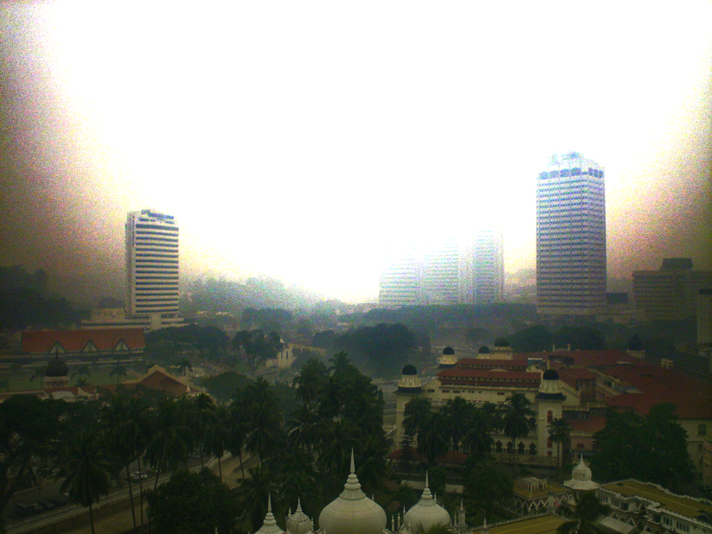

# Hazing and Dehazing image processing project
CSE4019: Image Processing at VIT, Vellore.

## Dehazing - Color Attenuation

Implementation of Fast Single Image Haze Removal Algorithm Using Color Attenuation Prior.

### [Research Paper](https://github.com/jacobjohn2016/Hazing-and-Dehazing-Project/blob/master/qingsongzhu2015.pdf)
* Q. Zhu, J. Mai, and L. Shao ,"A Fast Single Image Haze Removal Algorithm Using Color Attenuation Prior", in IEEE Transactions On Image Processing, Vol. 24, NO. 11, NOVEMBER 2015, pp. 3522-3533

### Instructions
```bash
folder structure:
------------------
Dehazing-Color-Attenuation/dehazed.jpg # dehazed output
                           vit.jpg # sample input image
                           dehaze.py # main
```
    
To dehaze:
```bash
run python3 dehaze.py vit.jpg the output 'dehazed.jpg' will be saved in the same folder
```

### Contributions
* _Original author_ - [TummanapallyAnuraag](https://github.com/TummanapallyAnuraag)
* _Made code reproducible_ - [jacobjohn2016](https://github.com/jacobjohn2016)

## Dehazing - Dark Channel Prior
This program implement single image dehazing using dark channel prior. 

### Research Papers
* [He, Kaiming, Jian Sun, and Xiaoou Tang. "Single image haze removal using dark channel prior." IEEE transactions on pattern analysis and machine intelligence 33.12 (2011): 2341-2353.](https://github.com/jacobjohn2016/Hazing-and-Dehazing-Project/blob/master/kaiminghe2011.pdf)
* [He, Kaiming, Jian Sun, and Xiaoou Tang. "X.: Guided image filtering." In: ECCV. 2010.](https://github.com/jacobjohn2016/Hazing-and-Dehazing-Project/blob/master/he2010.pdf)

### Instructions
```bash
folder structure:
------------------
Dehazing-Dark-Channel-Prior/image/ # image folder
                                14.png
                                15.png # main image
                                16.png
                                J.png
Dehazing-Dark-Channel-Prior/dehaze.py # file to execute
```
To dehaze save your image file as 15.png in the `./image` folder:
```bash
run python3 dehaze.py the output 'J.png' will be saved in the same folder
```

### Examples - Before and After Dehazing
<center>


</center>

### [Blog](http://www.freethatphoto.com/how-dehazing-works-photo/)
- How dehazing works: a simple explanation

### Contributions
* _Original author_ - [He-Zhang](https://github.com/He-Zhang/image_dehaze)
* _Made code reproducible_ - [jacobjohn2016](https://github.com/jacobjohn2016)

## Hazing

### [Research Paper](https://github.com/jacobjohn2016/Hazing-and-Dehazing-Project/blob/master/zhang2017.pdf)
* Zhang, Ning, Lin Zhang, and Zaixi Cheng. "Towards Simulating Foggy and Hazy Images and Evaluating Their Authenticity." International Conference on Neural Information Processing. Springer, Cham, 2017.

### Instructions:  
```bash
folder structure:
------------------
Hazing/FoHIS/const.py  # define const
             fog.py  # main
             parameter.py # all parameters used in simulating fog/haze are defined here.
             tool_kit.py # some useful functions
    
Hazing/AuthESI/compute_aggd.py
               compute_authenticity.py  # main
               guided_filter.py  # some functions
               prisparam_16_hazeandfog.mat  # pre-trained model
        
Hazing/img/img.jpg  # RGB image
           imgd.jpg  # depth image
           result.jpg  # simulation
```

1. To simulate fog/haze effects:
```bash
run python fog.py, the output 'result.jpg' will be saved in ../img/
```

2. To evaluate the authenticity:
```bash
run python compute_authenticity.py to evaluate 'result.jpg' in ../img/
```                  

### Contributions
* _Original author_ - [noahzn (Noah)](https://github.com/noahzn)
* _Made code reproducible_ - [jacobjohn2016](https://github.com/jacobjohn2016)

## Depth Map

1. [Facebook 3D Photo Depth Map Generator using Monodepth](https://3dphoto.io/uploader/)
2. [DhruvJawalkar/Depth-Map-Prediction-from-a-Single-Image-using-a-Multi-Scale-Deep-Network](https://github.com/DhruvJawalkar/Depth-Map-Prediction-from-a-Single-Image-using-a-Multi-Scale-Deep-Network)

### Instructions

```bash
.
├── custom_transforms.py
├── data
│   └── add_dataset_files.md # add NYU dataset here
├── dataset.py
├── depth-prediction.ipynb # run this notebook
├── imgs # put your own images here
├── model_utils.py
├── nn_model.py
└── plot_utils.py
```

1. Download `NYUDataset` using steps from [Mega](https://mega.nz/folder/LkBnwKaJ#h1_Mk9mUYdy3UZEc85GDMw).
2. Place them in the `Depth-Map/data` folder.
3. Download model weights from [Mega](https://mega.nz/file/XtoEwJ4Y#qL9LcfmJycCXgGxPdU3c0qYMkW1sc-c1FoDIy53VeaE) and place them in the `Depth-Map` folder.
4. Place your own images in `Depth-Map/imgs`
5. Run the `Depth-Map/depth-prediction.ipynb` notebook.